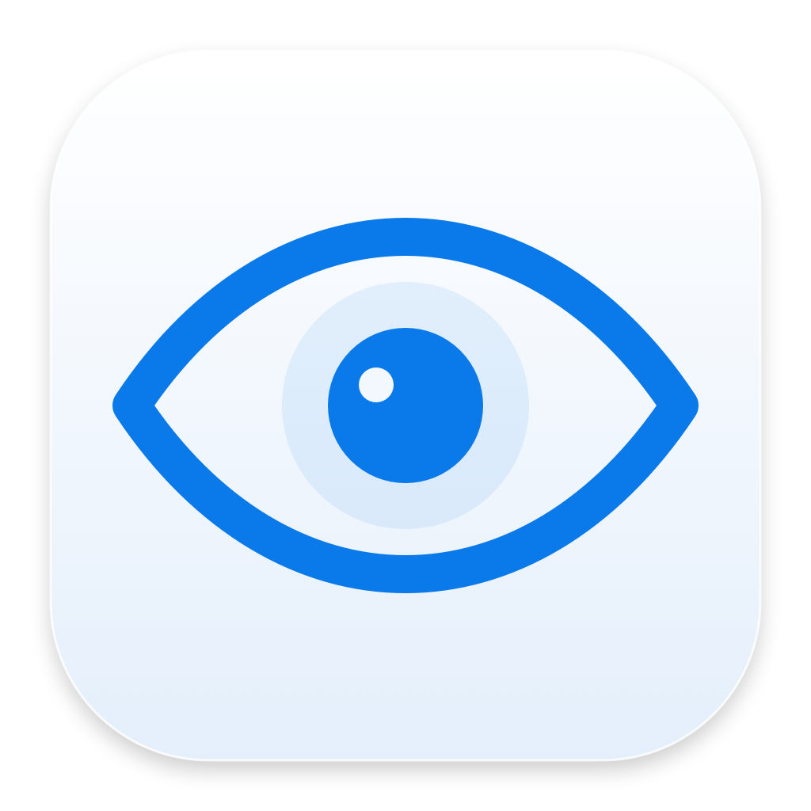
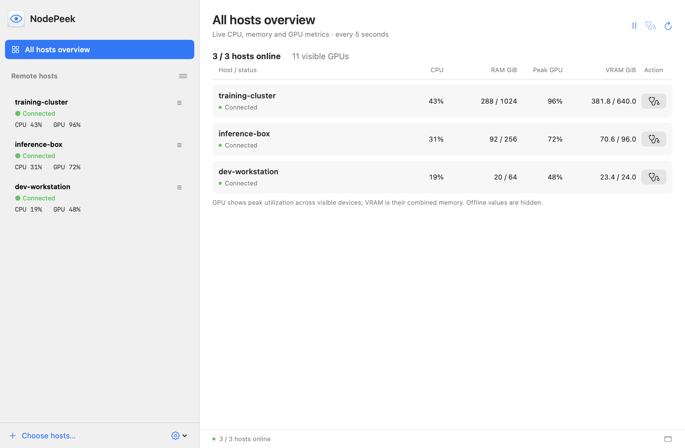
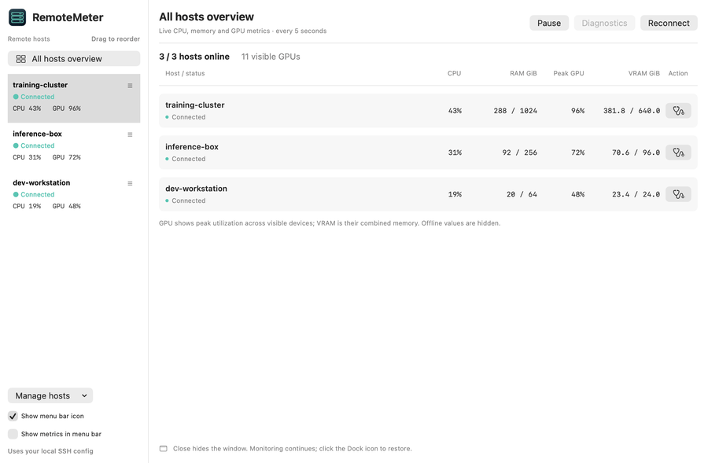

<p align="center"></p>
<h1 align="center">NodePeek</h1>
<p align="center">Your remote machines, at a glance.</p>
<p align="center"><a href="README.zh-CN.md">简体中文</a> · <a href="docs/INSTALL.md">Installation</a> · <a href="CONTRIBUTING.md">Contributing</a> · <a href="LICENSE">MIT License</a></p>



**Private preview.** This repository is being prepared for a public release. All screenshots and the demo below use synthetic hosts and metrics.

## Why NodePeek?

Check your remote training machines without opening another SSH terminal. NodePeek uses your existing SSH aliases, keys and jump hosts; no remote agent installation is required.

- **Fleet overview:** see CPU, memory, peak GPU utilization and combined VRAM across selected hosts.
- **Dense GPU details:** one row per GPU, including utilization, VRAM, temperature and power.
- **Menu bar access:** a compact icon by default, with optional live metrics.
- **Native macOS behavior:** drag to reorder hosts; close the window to keep monitoring in the background; restore it from the Dock.
- **Connection diagnostics:** explanations and next steps for authentication, host-key, network, Slurm and dependency errors.
- **English and Simplified Chinese:** follows macOS language preferences.
- **Persistent connections:** automatic retry and sleep/wake recovery, with pause/resume controls.



## Get started

**Mac:** Apple Silicon, macOS 13 or later. **Remote:** Linux and Python 3; NVIDIA GPU metrics require `nvidia-smi`.

### Build from source

Install [Apple Command Line Tools](https://developer.apple.com/xcode/resources/) first, then:

```bash
git clone https://github.com/YanjieZe/NodePeek.git
cd NodePeek
./build.sh
open NodePeek.app
```

The repository is currently private, so cloning requires access. No third-party Swift or Python runtime packages are needed.

### Download a build

Invited repository members can obtain the ZIP from the private draft release or the latest successful [CI run](https://github.com/YanjieZe/NodePeek/actions). Extract it and move NodePeek.app to Applications.

**Builds are ad-hoc signed, not Developer ID signed or notarized.** macOS may block the first launch. See [installation and Gatekeeper guidance](docs/INSTALL.md). No Apple Developer account is needed to build from source.

### Connect your first machine

Verify that your alias works in Terminal:

```sshconfig
Host training-server
    HostName your-server.example.com
    User your-user
    IdentityFile ~/.ssh/id_ed25519
```

Run `ssh training-server`, verify the host identity, and complete key/agent setup. Launch NodePeek and select the alias during first-run setup. No machine is contacted before you choose it.

## How it works

Each selected host gets one persistent SSH connection. An in-memory Python collector samples `/proc` and invokes `nvidia-smi`, returning JSON approximately every five seconds. NodePeek installs no remote files, packages or services.

CPU is the busy fraction between `/proc/stat` samples. Memory is `MemTotal - MemAvailable`, shown in GiB. **Containers may expose host-level CPU/memory, not container quotas.** The overview uses maximum GPU utilization and summed VRAM across visible devices. GPU-specific unsupported counters display as unavailable.

History contains the last 60 samples in memory. Collection stops during Mac sleep. There is no telemetry, cloud dashboard, disk history, process control or alerting.

## Development

```bash
./test.sh      # Offline tests in English and Chinese
./package.sh   # App ZIP and SHA-256 checksum in dist/
./demo.sh      # Synthetic screenshots (no SSH)
```

Tests cover first-run setup, config discovery, saved-order migration, connection preservation, native reorder handling, error classification and collector calculations. See [CONTRIBUTING.md](CONTRIBUTING.md) and [release instructions](docs/RELEASING.md).

| Area | Source |
|---|---|
| SSH lifecycle and collection | `Sources/HostMonitor.swift`, `Resources/collector.py` |
| Preferences and host selection | `Sources/Store.swift`, `Sources/SSHConfig.swift` |
| Native sidebar and window behavior | `Sources/MachineList.swift`, `Sources/WindowLifecycle.swift` |
| Overview, detail and diagnostics UI | `Sources/SetupAndOverview.swift`, `Sources/DetailView.swift`, `Sources/Diagnostics.swift` |
| Translations | `Sources/Localization.swift` |

## Current limits

- Apple Silicon builds only; Linux remote hosts and NVIDIA GPU metrics.
- Non-interactive SSH authentication: unlock encrypted keys in your agent first.
- Explicit SSH aliases and Include files are discovered; complex quoting in alias discovery is limited. OpenSSH resolves the actual connection options.
- A short connection test may succeed while cluster policies still restrict access to particular compute nodes.
- Diagnostic output can contain hostnames and paths. Redact it before sharing.

## License

[MIT](LICENSE) © 2026 Yanjie Ze.
