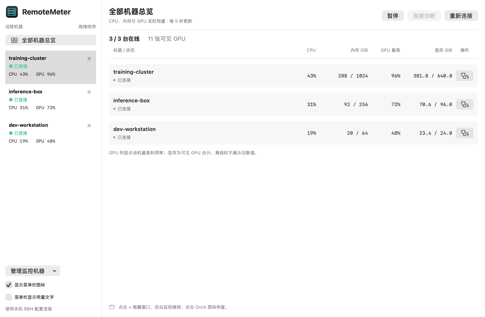

# NodePeek

*Your remote machines, at a glance.*

在 Mac 菜单栏和桌面窗口查看远程机器的 GPU、CPU、内存用量。

[English](README.md) · [安装说明](docs/INSTALL.md) · [MIT 许可证](LICENSE)



**当前为 private preview，仓库暂不公开。截图和演示视频全部使用虚构机器与模拟指标。**

## 演示视频

[](docs/assets/demo.mp4)

[观看或下载完整 MP4](docs/assets/demo.mp4) · 20 秒，无音频。多机器总览 → 8 张 GPU 详情 → 切换机器 → 深色模式。使用真实应用视图和模拟指标生成，不包含私人服务器信息。

## 让 Codex / Claude Code 帮你安装

把这句话发给**运行在你 Mac 上的** coding agent：

> 请阅读 https://github.com/YanjieZe/NodePeek/blob/main/docs/AGENT_INSTALL.md ，按指南在这台 Mac 上构建、安装并验证 NodePeek。保留我的 SSH 配置和现有设置，向我确认要监控的机器。

仓库目前仍为 Private，需要已有 GitHub 访问权限。如果 agent 无法读取网页，可以先用已登录的 Git 克隆，再让它读取本地 `docs/AGENT_INSTALL.md`。公开后同一个链接仍可使用。远程 Linux 或云端 agent 无法直接安装到你的 Mac。

安装脚本默认使用 `~/Applications/NodePeek.app`，不需要 sudo。已有版本需先退出，再用 `--replace` 升级；旧 app 会先备份。

## 功能

- 首次启动从本机 SSH 配置选择机器，不默认连接任何主机。
- 多机器总览、每张 GPU 一行的紧凑详情、温度与功耗。
- 原生拖拽排序，自动保存选择与顺序。
- 点击 × 隐藏窗口，监控继续；点击 Dock 图标恢复。
- 菜单栏默认只显示图标，可选择显示用量文字。
- 连接诊断：网络、密钥、主机指纹、Slurm 限制、Python 和 GPU 驱动问题。
- 中英双语，跟随 macOS 语言偏好。
- 自动重连、休眠恢复、暂停监控与登录启动。

## 安装

要求：Apple Silicon Mac、macOS 13+。远端需要 Linux 和 Python 3；NVIDIA GPU 指标需要 `nvidia-smi`。

安装 Apple Command Line Tools 后可从源码构建：

```bash
git clone https://github.com/YanjieZe/NodePeek.git
cd NodePeek
./build.sh
open NodePeek.app
```

仓库仍为私有，克隆和下载需要访问权限。下载包在 Release 草稿或成功的 CI 任务中。**目前仅做本地 ad-hoc 签名，没有 Developer ID 签名和 Apple 公证**，首次打开可能被系统拦截。请阅读[安装说明](docs/INSTALL.md)，不要全局关闭 Gatekeeper。

## 使用

1. 在 `~/.ssh/config` 配好别名，先用终端确认 `ssh 别名` 可以连接。
2. 启动 NodePeek，勾选想监控的机器。
3. 左侧切换机器或查看全部总览；拖动行可排序。
4. 遇到连接问题，点击“连接诊断”查看原因和检查命令。

远端采集通过持续 SSH 会话执行，不安装服务、文件或第三方 Python 包。约每 5 秒更新，最近 60 次采样仅保存在内存中。

CPU 和内存是系统视角，在容器中可能反映宿主机，而非容器配额。GPU 总览显示最高利用率与可见 GPU 的显存合计。没有遥测、云端历史、进程控制或告警。

## 开发与验证

```bash
./test.sh      # 中英文离线测试
./package.sh   # 生成 ZIP 和 SHA-256
./demo.sh      # 生成模拟数据截图，不连接远端
```

提交前移除真实主机名、IP、路径、SSH 配置和密钥。参见[贡献指南](CONTRIBUTING.md)与[发布流程](docs/RELEASING.md)。
